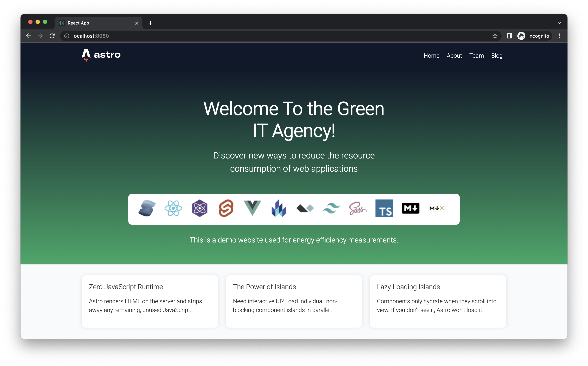

# Green Corporate Website
In this project, which is part of my master's thesis, various front-end web technologies are analysed and evaluated in terms of their energy efficiency. The Green Corporate Website is a fictitious company website which is supposed to inform about the services or the employees of the company. The website is used to determine the individual energy demand of the website with the help of standard usage scenarios.

## Usage Scenarios
In order to be able to measure the energy consumption as identically as possible for each adaptation of the web application, usage scenarios are created. The usage scenarios automatically simulate a visit to the website. During the execution, different metrics are tracked with a measurement procedure to be able to determine the energy consumption.

## Measurement
<!-- Source: https://dl.gi.de/handle/20.500.12116/39398 -->
It is necessary to determine the consumption of each component of the application such as web server, a web client and,
if applicable, a database. For this purpose, the [Green Metrics Tool](https://docs.green-coding.berlin/) provides 
tools for measuring the consumption of a web application. The components are deployed independently of each other in 
Docker containers and can then be measured using the usage scenarios with the metrics power consumption, memory load or 
network 
traffic.

## Analysis

The [Principles of Green Software Engineering](https://principles.green/) contain generic recommendations for making 
software more sustainable. Based on these 
principles, some technologies are analysed below.

### Client Side Rendering vs Static Side Rendering

Part of the research deals with different Javascript web frameworks. React.js has emerged as the market leader in the field of front-end web frameworks in recent years. The pages are rendered on the client side and thus have many advantages in terms of displaying dynamic content. However, the framework has also been criticised for the amount of data required to render web pages. For this reason, the frameworks Next.js and Asto.js are analysed comparatively using the same website. Both frameworks offer the possibility of rendering on the server side and even static rendering with some restrictions. On the one hand, this approach theoretically reduces the load on the client because less Javascript has to be interpreted, and on the other hand it could also reduce network traffic.

## Measure Application

If the Green Metric Tool has been successfully installed, only the desired application needs to be built. Instead of docker-compose, the docker command is also suitable, as long as less than one image is built with it.

`docker-compose -f docker-compose.yml up -d --build`

After the images have been created, it is necessary to navigate to the folder with the _runner.py_. This file is the 
starting point of the Green Metrics tool and must be executed with the following command:

`python3 runner.py --uri /path/to/project/with/usage_scenario --name yourMeasurmentName --allow-unsafe`